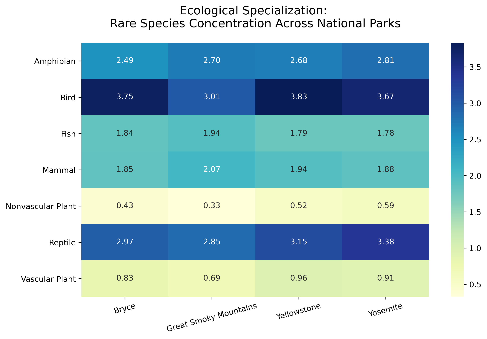
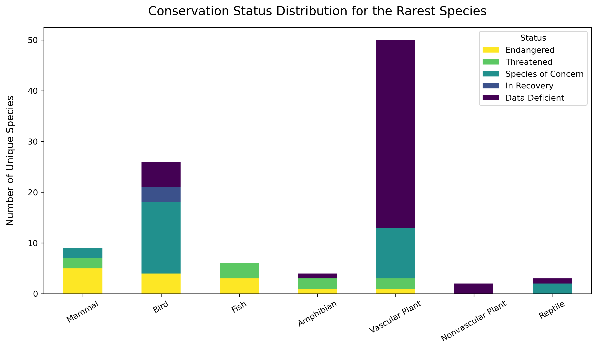

# Biodiversity Analysis Across Four U.S. National Parks

This project investigates the conservation status of various species across four major U.S. National Parks. By integrating species-level data with sighting records, the analysis identifies biodiversity hotspots and evaluates the protection needs of unique biological groups.

## Project Goals
The primary objective of this analysis is to determine which taxonomic categories are most at risk and how rare species are distributed geographically. 
The research specifically addressed the distribution of conservation statuses like "Engandered" and "Threatened" across different biological categories, identifies the rarest species based on observation frequency, and compares the concentration of these rare species across the four parks. 

Key research questions include:
- What is the distribution of conservation status (Endangered, Threatened, etc.) across different biological categories?
- Which species are the most "rare" based on observation frequency?
- How does the concentration of rare species vary between Yellowstone, Yosemite, Bryce, and Great Smoky Mountains National Park?

### Data Processing & Key Features
The analysis was performed using Python and the Pandas library, with a focus on data integrity and normalization. The workflow involved combining sighting records by scientific name and park location to calculate total population presence and developing a density metric to compare rare species observations across parks of different sizes. 
Categorical data types were managed to ensure accurate sorting of conservation statuses, while Seaborn and Matplotlib were utilized to create distributions, heatmaps and stacked bar charts for storytelling.

<b>Summary</b>: \
Combined sighting records by scientific name and park location to calculate total population presence. \
Normalization: Developed a density metric to compare rare species observations across parks of different sizes. \
Categorical Management: Handled complex data types to ensure accurate sorting of conservation statuses. \
Visualization: Utilized Seaborn and Matplotlib to create heatmaps and stacked bar charts for intuitive data storytelling. 

## Visualizations
Key Visualizations are included below. 

### Rare Species Concentration Heatmap
This heatmap illustrates the density of rare species across biological categories for each park. It highlights specific ecological specializations and identifies which parks serve as primary habitats for various rare animal and plant groups.

 

 

### Conservation Status Distribution
This visualization displays the protection levels of the rarest species in the dataset. By using a stacked bar chart, the analysis provides a clear breakdown of risk levels, such as Endangered or Species of Concern, relative to the total number of rare species identified in each category.

  

<b> 
  
## Technologies Used
The project relies on a technical stack consisting of Python 3.x and the Pandas library for data manipulation and aggregation. Matplotlib and Seaborn were used for technical data visualization. Analysis was conducted within Jupyter Notebooks for documentation and reproducibility.

## How to Use
To use this repository, clone the files to your local machine and ensure you have the required datasets (<code>observations.csv</code> and <code>species_info.csv</code>) in the data directory.
Run the <code>biodiversity.ipynb</code> notebook to reproduce the complete analysis and all associated visualizations.
